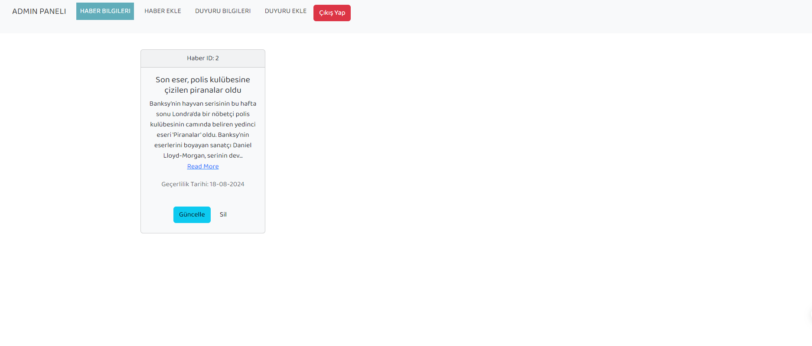
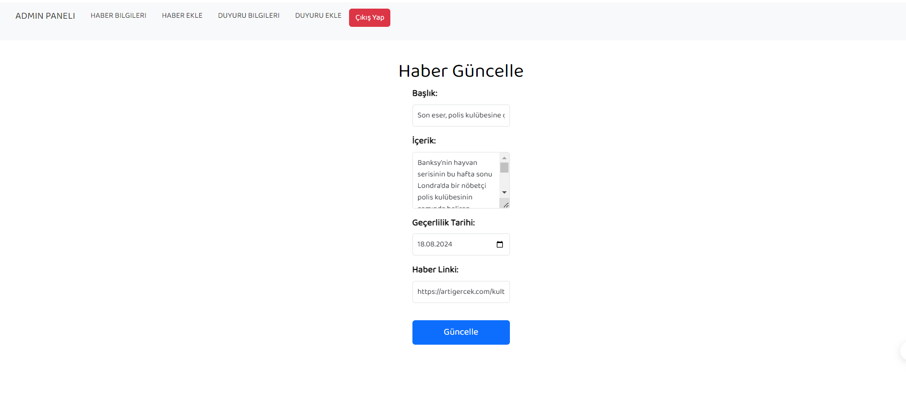
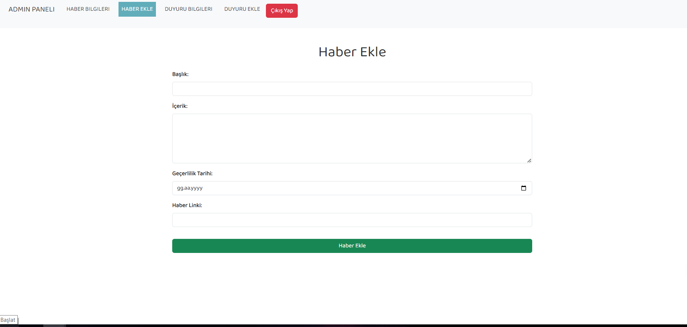
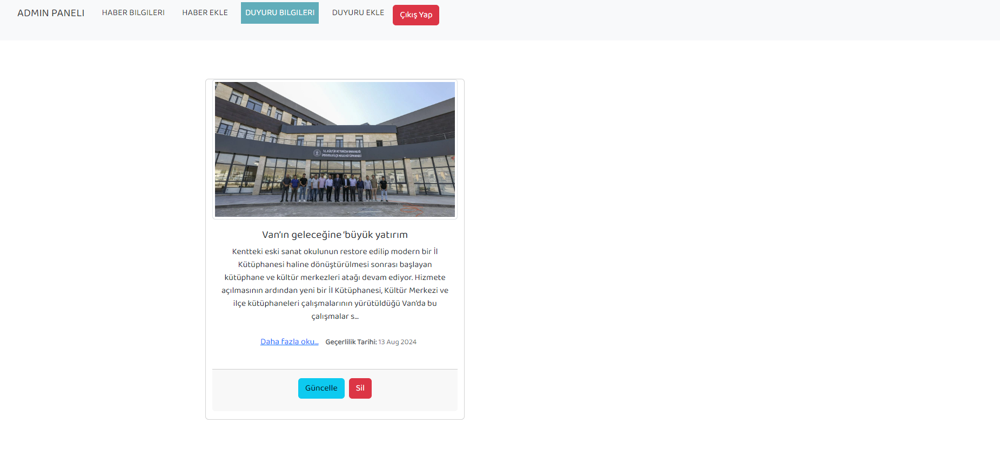
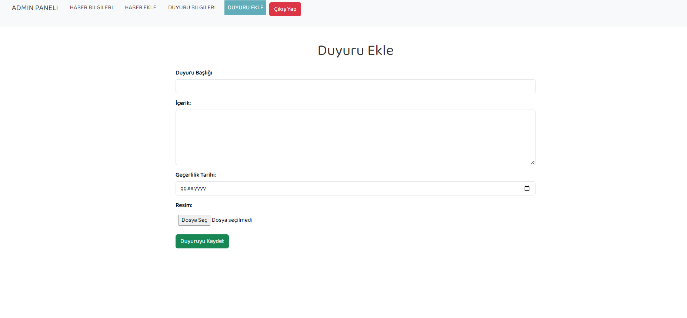
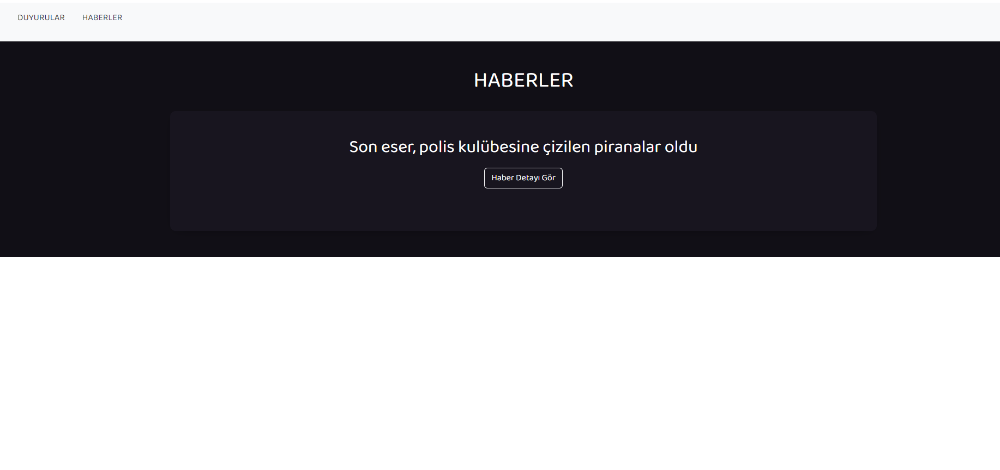
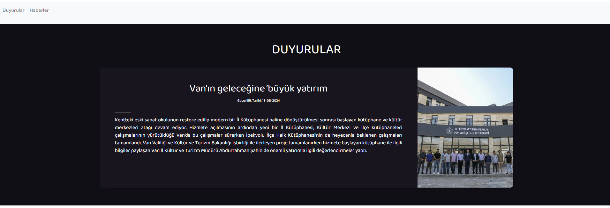
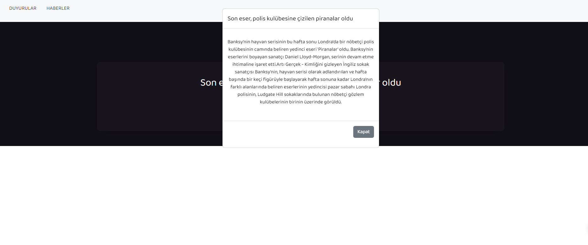

# Project Name

This project is an application that enables dynamic management of news and announcements on an association's website.

## Technologies Used

- **Backend**: Java, Spring Boot, Spring Security, Hibernate, PostgreSQL
- **Frontend**: React, TypeScript, Bootstrap

## Installation

### Requirements

- **Node.js and npm**: Download and install from [Node.js official website](https://nodejs.org).
- **Java Development Kit (JDK)**: Download and install [JDK 22](https://www.oracle.com/java/technologies/javase-jdk22-downloads.html).
- **IDE**: IntelliJ IDEA

## Project Setup

### 1. Download the Project with Git

First, clone your project to your local computer using Git. Enter the following command in your terminal or command prompt:

```bash
git clone https://github.com/ahmettb/news-website-app.git
```

### 2. Open the Project in IntelliJ IDEA

- **Java SDK and Lombok Installation**:
    - **Java SDK**:
        - Select JDK 22 from `File > Project Structure` menu.
    - **Lombok**:
        - Go to `Settings > Plugins` and install Lombok.

- **Import Backend Project**:
    - Import the backend project using `File > New > Module from Existing Sources`.
    - Enter database information in the `src/main/resources/application.properties` file.

### 3. Install Frontend Dependencies

Navigate to the frontend folder in the terminal:

```bash
cd path/to/frontend
npm install
```

### 4. Run the Project

- **Backend**: Run the project from the CmvInternTaskApplication class

- **Frontend**: Navigate to the frontend folder in the terminal and run the following command:

```bash
npm start
```

### 5. Admin Panel
 After running the project, to access the Admin Panel login screen, go to:
```bash
http://localhost:3000/login
```
- Username: **admin**
- Password: **admin123**
 
### Application Screenshots

<div style="display: flex; flex-wrap: wrap;">
  <div style="margin-right: 10px;">
    
  </div>
  <div>
    
  </div>
</div>

<div style="display: flex; flex-wrap: wrap;">
  <div style="margin-right: 10px;">
    
  </div>
  <div>
    
  </div>
</div>

<div style="display: flex; flex-wrap: wrap;">
  <div style="margin-right: 10px;">
    
  </div>
  <div>
    
  </div>
</div>
<div style="display: flex; flex-wrap: wrap;">
  <div style="margin-right: 10px;">
    
  </div>
  <div>
    
  </div>
</div>