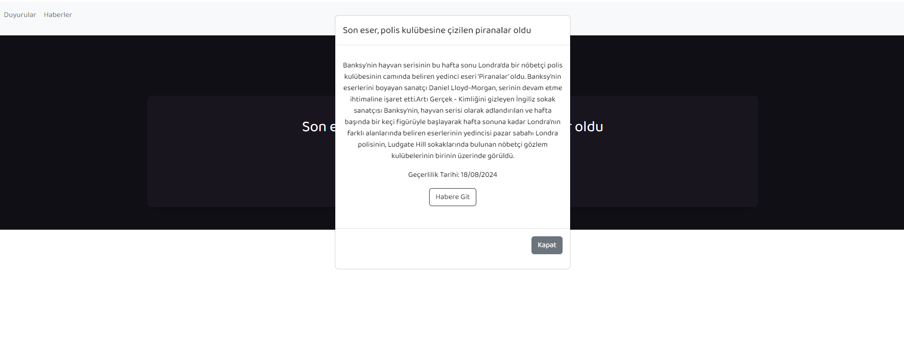

# Proje Adı

Bu proje, bir derneğin web sitesinde dinamik olarak haberler ve duyuruların yönetilmesini sağlayan bir uygulamadır. 

## Kullanılan Teknolojiler

- **Backend**: Java, Spring Boot,Spring Security, Hibernate, PostgreSQL
- **Frontend**: React, TypeScript, Bootstrap

## Kurulum

### Gereksinimler

- **Node.js ve npm**: [Node.js'in resmi web sitesinden](https://nodejs.org) indirin ve yükleyin.
- **Java Development Kit (JDK)**: [JDK 22'yi](https://www.oracle.com/java/technologies/javase-jdk22-downloads.html) indirin ve yükleyin.
- **IDE**: IntelliJ IDEA

## Proje Kurulumu


### 1. Projeyi Git ile İndirin

Öncelikle, projenizi Git kullanarak yerel bilgisayarınıza klonlayın. Terminal veya komut istemcisine şu komutu girin:

```bash
git clone https://github.com/ahmettb/cmvInternTask.git
```

### 2. IntelliJ IDEA'da Projeyi Açın

- **Java SDK ve Lombok Kurulumu**:
    - **Java SDK**:
        - `File > Project Structure` menüsünden JDK 22'yi seçin.
    - **Lombok**:
        - `Settings > Plugins` kısmına gidin ve Lombok'u yükleyin.

- **Backend Projesini İçe Aktarın**:
    - `File > New > Module from Existing Sources` ile backend projesini içe aktarın.
    - `src/main/resources/application.properties` dosyasında veritabanı bilgilerini girin.

### 3. Frontend Bağımlılıklarını Yükleyin

Terminalde frontend klasörüne gidin:

```bash
cd path/to/frontend
npm install
```

### 4. Projeyi Çalıştırın

- **Backend**: CmvInternTaskApplication sınıfından projeyi çalıştırın


- **Frontend**: Terminalde frontend klasörüne gidin ve aşağıdaki komutu çalıştırın:

```bash
npm start
```

### 5. Admin Paneli
 Projeyi çalıştırdıktan sonra Admin Paneli giriş ekranına gitmek için
şu adrese gidin:
```bash
http://localhost:3000/login
```
- Kullanıcı Adı: **admin**
- Şifre: **admin123**
 
### Uygulama Ekran Görüntüleri


<div style="display: flex; flex-wrap: wrap;">
  <div style="margin-right: 10px;">
    
  </div>
  <div>
    
  </div>
</div>

<div style="display: flex; flex-wrap: wrap;">
  <div style="margin-right: 10px;">
    
  </div>
  <div>
    
  </div>
</div>

<div style="display: flex; flex-wrap: wrap;">
  <div style="margin-right: 10px;">
    
  </div>
  <div>
    
  </div>
</div>
<div style="display: flex; flex-wrap: wrap;">
  <div style="margin-right: 10px;">
    
  </div>
  <div>
    
  </div>
</div>